# TypeScript 빌드 오류 수정 및 기능 무결성 검증 통합 사양서

## 📋 문서 개요

**목적:** TypeScript 빌드 오류 44건 수정 + 기존 기능 무결성 100% 보장
**작성일:** 2025-12-23
**총 예상 소요 시간:** 5.5시간 (수정 3.5시간 + 검증 2시간)

---

## 🎯 전체 작업 프로세스

```mermaid
graph LR
    A[준비] --> B[Unit 1-8 수정]
    B --> C[1차 검증: 빌드]
    C --> D[2차 검증: 런타임]
    D --> E[3차 검증: 데이터]
    E --> F[최종 승인]
```



---

## 🔧 UNIT 0: 작업 준비 및 백업

### 목적
안전한 롤백을 위한 환경 준비

### 작업 절차

```bash
# 1. 현재 상태 백업
git status
git add .
git commit -m "backup: before type fixes - 44 errors baseline"
git tag backup-before-typefix-$(date +%Y%m%d-%H%M%S)

# 2. 작업 브랜치 생성
git checkout -b fix/typescript-errors-44

# 3. 빌드 출력물 백업 (비교용)
npm run build -- --force 2>&1 | tee build-errors-before.log || true
if [ -d dist ]; then
  cp -r dist dist-before-typefix
fi

# 4. 의존성 확인
npm list typescript @types/node
node --version
npm --version
```

### 검증 체크리스트
- [ ] 백업 커밋 생성 완료
- [ ] 백업 태그 생성 완료
- [ ] 작업 브랜치 체크아웃 완료
- [ ] `build-errors-before.log` 파일 생성 (44개 오류 기록)
- [ ] `dist-before-typefix/` 폴더 존재

### 예상 소요 시간
10분

---

## 🔧 UNIT 1: API Response 타입 표준화

### 목적
모든 API 함수가 일관된 `ApiResponse<T>` 형식 반환하도록 수정

### 영향 범위
- 파일 수: 3개
- 오류 해결: 5건
- 기능 영향도: ⚠️ 높음 (API 레이어 전체)

### 수정 내용

#### 1.1 `src/lib/api/auth.ts`
```typescript
// 수정 전 (라인 1, 21)
// import 없음
me: () => api.get<ApiResponse<ApiUser>>('/api/v1/auth/me'),

// 수정 후
import type { ApiResponse } from '@/types/api';

export const authApi = {
  login: (credentials: LoginCredentials) =>
    api.post<ApiResponse<AuthResponse>>('/api/v1/auth/login', credentials),
  me: () => api.get<ApiResponse<ApiUser>>('/api/v1/auth/me'),
  // ... 기존 메서드 유지
};
```

#### 1.2 `src/lib/api/departments.ts`
```typescript
// 수정 전 (라인 1 - import 미사용 경고 발생)
import type { ApiResponse } from '@/types/api';
import type { DepartmentResponse } from '@/types/departments';

export const getDepartments = async (
  params?: { is_active?: boolean }
): Promise<DepartmentResponse[]> => {
  const response = await api.get('/api/v1/departments', { params });
  return response.data;
};

export const createDepartment = async (
  data: { department_code: string; department_name: string; is_active?: boolean }
): Promise<DepartmentResponse> => {
  const response = await api.post('/api/v1/departments', data);
  return response.data;
};

export const updateDepartment = async (
  id: string,
  data: { department_code: string; department_name: string; is_active?: boolean }
): Promise<DepartmentResponse> => {
  const response = await api.put(`/api/v1/departments/${id}`, data);
  return response.data;
};

// 수정 후
import type { ApiResponse } from '@/types/api';
import type { DepartmentResponse } from '@/types/departments';

export const getDepartments = async (
  params?: { is_active?: boolean }
): Promise<ApiResponse<DepartmentResponse[]>> => {
  const response = await api.get<ApiResponse<DepartmentResponse[]>>(
    '/api/v1/departments',
    { params }
  );
  return response.data;
};

export const createDepartment = async (
  data: { department_code: string; department_name: string; is_active?: boolean }
): Promise<ApiResponse<DepartmentResponse>> => {
  const response = await api.post<ApiResponse<DepartmentResponse>>(
    '/api/v1/departments',
    data
  );
  return response.data;
};

export const updateDepartment = async (
  id: string,
  data: { department_code: string; department_name: string; is_active?: boolean }
): Promise<ApiResponse<DepartmentResponse>> => {
  const response = await api.put<ApiResponse<DepartmentResponse>>(
    `/api/v1/departments/${id}`,
    data
  );
  return response.data;
};
```

#### 1.3 `src/hooks/useDepartments.ts`
```typescript
// 수정 전 (라인 21, 36, 60)
const query = useApiQuery(
  ['departments', params],
  () => getDepartments(params),
  { enabled }
);

const createMutation = useApiMutation(
  (data: { department_code: string; department_name: string; is_active?: boolean }) =>
    createDepartment(data),
  // ...
);

const updateMutation = useApiMutation(
  ({ id, data }: {
    id: string;
    data: { department_code: string; department_name: string; is_active?: boolean };
  }) => updateDepartment(id, data),
  // ...
);

// 수정 후 - 타입이 자동으로 맞춰지므로 변경 불필요
// (departments.ts 수정으로 자동 해결됨)
```

### 기능 검증 절차

#### 검증 1-A: 빌드 검증
```bash
npm run build 2>&1 | tee build-unit1.log

# 확인사항
grep "lib/api/auth.ts:21" build-unit1.log && echo "❌ 미해결" || echo "✅ 해결"
grep "lib/api/departments.ts:1" build-unit1.log && echo "❌ 미해결" || echo "✅ 해결"
grep "useDepartments.ts:21" build-unit1.log && echo "❌ 미해결" || echo "✅ 해결"
```

#### 검증 1-B: 런타임 검증
```bash
npm run dev
```

**브라우저 테스트 (http://localhost:3000):**
```
1. 로그인 페이지 접속
   - 사용자명/비밀번호 입력
   - 로그인 버튼 클릭
   ✅ 정상 로그인 확인
   ✅ 콘솔 에러 없음

2. 부서 관리 페이지 (/admin/departments)
   ✅ 부서 목록 로드 확인
   ✅ Network 탭: GET /api/v1/departments 응답 구조 확인
      {
        "data": [ { "id": "...", "department_code": "...", ... } ],
        "total": 10,
        ...
      }

3. 부서 추가 테스트
   - "부서 추가" 버튼 클릭
   - 부서 코드: UNIT1TEST
   - 부서명: 유닛1테스트
   - 활성화: 체크
   - 저장 버튼 클릭
   ✅ 성공 Toast 메시지 표시
   ✅ 목록에 새 부서 추가됨
   ✅ Network 탭: POST /api/v1/departments 응답 확인

4. 부서 수정 테스트
   - 방금 추가한 부서의 "수정" 버튼 클릭
   - 부서명: 유닛1테스트수정
   - 저장
   ✅ 수정 반영 확인
   ✅ Network 탭: PUT /api/v1/departments/{id} 응답 확인
```

#### 검증 1-C: React Query DevTools 확인
```typescript
// src/main.tsx에 임시 추가
import { ReactQueryDevtools } from '@tanstack/react-query-devtools';

// App 내부
<ReactQueryDevtools initialIsOpen={false} />
```

```
1. 부서 관리 페이지에서 React Query 아이콘 클릭
2. ['departments'] 쿼리 선택
3. Data 탭 확인:
   ✅ data 구조가 ApiResponse<DepartmentResponse[]> 형식
   ✅ data.data 배열 존재
   ✅ data.total, data.page 등 메타데이터 존재
```

### 롤백 조건
- [ ] 빌드 실패 시
- [ ] 로그인 불가 시
- [ ] 부서 목록 로드 실패 시
- [ ] 부서 추가/수정 실패 시

### 검증 체크리스트
- [ ] `lib/api/auth.ts:21` 오류 해결
- [ ] `lib/api/departments.ts:1` 오류 해결
- [ ] `useDepartments.ts:21, :36, :60` 오류 해결 (3건)
- [ ] 로그인 기능 정상 동작
- [ ] 부서 목록 조회 정상 동작
- [ ] 부서 추가 정상 동작
- [ ] 부서 수정 정상 동작
- [ ] React Query 캐시 데이터 구조 정상

### 예상 소요 시간
- 수정: 30분
- 검증: 25분
- **합계: 55분**

---

## 🔧 UNIT 2: 타입 재선언 충돌 해결

### 목적
중복 export된 타입 이름 충돌 제거

### 영향 범위
- 파일 수: 5개
- 오류 해결: 2건
- 기능 영향도: ⚠️ 중간 (전역 타입 import)

### 수정 내용

#### 2.1 타입 충돌 분석
```bash
# 충돌 확인
grep -r "export.*BusinessType" src/types/
grep -r "export.*UserRole" src/types/
```

**예상 출력:**
```
src/types/consultations.ts:export type BusinessType = 'A' | 'B' | 'C';
src/types/manuals.ts:export type BusinessType = 'RETAIL' | 'CORPORATE';
src/types/auth.ts:export type UserRole = 'ADMIN' | 'USER' | 'REVIEWER';
src/types/users.ts:export type UserRole = 'ADMIN' | 'USER' | 'REVIEWER';
```

#### 2.2 `src/types/index.ts` 수정
```typescript
// 수정 전
export * from './api';
export * from './auth';
export * from './consultations';
export * from './manuals';
export * from './reviews';
export * from './commonCode';
export * from './users';
export * from './departments';

// 수정 후 (명시적 re-export)
// API 타입
export type { ApiResponse, ApiError, PaginationParams } from './api';

// 인증 타입
export type {
  UserRole,  // auth.ts에서만 export
  ApiUser,
  LoginCredentials,
  AuthResponse
} from './auth';

// 상담 타입
export type {
  ConsultationDetail,
  ConsultationListItem,
  ConsultationSearchParams,
  ConsultationResponse
  // BusinessType는 제외 (manuals와 충돌)
} from './consultations';

// 메뉴얼 타입
export type {
  BusinessType,  // manuals.ts에서만 export
  ManualDraftResponse,
  ManualListItem,
  ManualDetail,
  ManualForm,
  ManualDraftCreateResponse
} from './manuals';

// 리뷰 타입
export type {
  ReviewTask,
  ReviewComment,
  ReviewStatus
} from './reviews';

// 공통코드 타입
export type {
  CommonCode,
  CommonCodeCategory
} from './commonCode';

// 사용자 타입
export type {
  UserResponse,
  CreateUserRequest,
  UpdateUserRequest,
  UserSearchParams
  // UserRole 제외 (auth와 충돌)
} from './users';

// 부서 타입
export type {
  DepartmentResponse,
  DepartmentFormData
} from './departments';
```

#### 2.3 충돌 타입 사용처 확인 및 수정
```bash
# BusinessType 사용처 확인
grep -r "BusinessType" src/ --include="*.ts" --include="*.tsx" | grep -v "types/"

# 필요시 import 경로 수정
```

**수정 예시:**
```typescript
// 기존 코드에서
import { BusinessType } from '@/types';
// 또는
import { BusinessType } from '@/types/consultations';

// 수정 후 (manuals의 BusinessType만 사용)
import { BusinessType } from '@/types/manuals';
// 또는 (types/index.ts를 통한 import는 자동으로 manuals 것을 가져옴)
import { BusinessType } from '@/types';
```

### 기능 검증 절차

#### 검증 2-A: 빌드 검증
```bash
npm run build 2>&1 | tee build-unit2.log

# 확인사항
grep "types/index.ts:13" build-unit2.log && echo "❌ 미해결" || echo "✅ 해결"
grep "types/index.ts:14" build-unit2.log && echo "❌ 미해결" || echo "✅ 해결"
grep "has already exported" build-unit2.log && echo "❌ 충돌 존재" || echo "✅ 충돌 해결"
```

#### 검증 2-B: Import 검증
```bash
# 모든 파일에서 타입 import 오류 확인
npm run lint 2>&1 | grep "Cannot find name"
# 출력 없으면 ✅
```

#### 검증 2-C: 런타임 검증
```
전체 애플리케이션 기능 테스트:

1. 상담 검색 (/consultations/search)
   ✅ 검색 기능 정상
   ✅ 상담 상세보기 정상
   ✅ business_type 필드 표시 정상

2. 메뉴얼 초안 생성 (/manuals/drafts/new)
   ✅ 폼 렌더링 정상
   ✅ BusinessType 선택 드롭다운 정상

3. 사용자 관리 (/admin/users)
   ✅ 목록 조회 정상
   ✅ UserRole 필터 정상

4. 브라우저 콘솔
   ✅ 타입 관련 경고 없음
```

### 롤백 조건
- [ ] 빌드 시 여전히 충돌 오류 발생
- [ ] 런타임에 타입 관련 오류 발생
- [ ] import 오류로 화면이 로드되지 않음

### 검증 체크리스트
- [ ] `types/index.ts:13` 오류 해결
- [ ] `types/index.ts:14` 오류 해결
- [ ] 모든 타입 import 정상 동작
- [ ] 상담 검색 기능 정상
- [ ] 메뉴얼 생성 기능 정상
- [ ] 사용자 관리 기능 정상

### 예상 소요 시간
- 수정: 25분
- 검증: 20분
- **합계: 45분**

---

## 🔧 UNIT 3: 선택적 속성 타입 안전성 강화

### 목적
`undefined` 가능성이 있는 값을 안전하게 처리

### 영향 범위
- 파일 수: 2개
- 오류 해결: 4건
- 기능 영향도: ⚠️ 중간 (부서 관리, 상담-메뉴얼 연동)

### 수정 내용

#### 3.1 `src/components/departments/DepartmentModal.tsx`
```typescript
// 수정 전 (라인 30-40 부근)
useEffect(() => {
  if (department) {
    setDepartmentCode(department.department_code);
    setDepartmentName(department.department_name);
    setIsActive(department.is_active); // ❌ 라인 35: undefined 가능
  } else {
    setDepartmentCode('');
    setDepartmentName('');
    setIsActive(true);
  }
}, [department]);

// 수정 후
useEffect(() => {
  if (department) {
    setDepartmentCode(department.department_code);
    setDepartmentName(department.department_name);
    setIsActive(department.is_active ?? true); // ✅ 기본값 true
  } else {
    setDepartmentCode('');
    setDepartmentName('');
    setIsActive(true);
  }
}, [department]);
```

**기본값 선택 근거:**
```typescript
// src/types/departments.ts 확인
export interface DepartmentResponse {
  id: string;
  department_code: string;
  department_name: string;
  is_active?: boolean;  // 선택적 속성
}

// 신규 생성 시 기본값이 true이므로 수정 시에도 true를 기본값으로 사용
```

#### 3.2 `src/hooks/useConsultationDetailForManual.ts`
```typescript
// 수정 전 (라인 15-30)
const mapToDetail = (response: ConsultationResponse): ConsultationDetail => {
  return {
    id: response.id,
    created_at: response.created_at,
    updated_at: response.updated_at,
    summary: response.summary,
    content: response.content,
    category: response.category,
    business_type: response.business_type ?? undefined, // ❌ 라인 23
    consultant_name: response.consultant_name,
  };
};

export const useConsultationDetailForManual = (consultationId: string | null) => {
  const query = useQuery({
    queryKey: ['consultation', consultationId],
    queryFn: () => getConsultationById(consultationId!),
    enabled: !!consultationId,
  });

  const detail = query.data ? mapToDetail(query.data) : null; // ❌ 라인 49

  return {
    ...query,
    data: detail, // ❌ 라인 51
  };
};

// 수정 후
const mapToDetail = (response: ConsultationResponse): ConsultationDetail => {
  return {
    id: response.id,
    created_at: response.created_at,
    updated_at: response.updated_at,
    summary: response.summary,
    content: response.content,
    category: response.category,
    business_type: response.business_type as BusinessType | null | undefined, // ✅ 명시적 타입 단언
    consultant_name: response.consultant_name,
  };
};

export const useConsultationDetailForManual = (consultationId: string | null) => {
  const query = useQuery<ConsultationResponse>({ // ✅ 제네릭 타입 추가
    queryKey: ['consultation', consultationId],
    queryFn: () => getConsultationById(consultationId!),
    enabled: !!consultationId,
  });

  const detail = query.data ? mapToDetail(query.data) : null; // ✅ 타입 추론 가능

  return {
    ...query,
    data: detail,
  } as UseConsultationDetailForManualResult; // ✅ 명시적 타입 단언
};
```

#### 3.3 타입 정의 확인
```typescript
// src/types/consultations.ts 확인
export interface ConsultationDetail {
  // ...
  business_type?: BusinessType | null;
}

// src/hooks/useConsultationDetailForManual.ts
export interface UseConsultationDetailForManualResult {
  data: ConsultationDetail | null;
  isLoading: boolean;
  error: Error | null;
  refetch: () => Promise<QueryObserverResult<ConsultationResponse, Error>>;
}
```

### 기능 검증 절차

#### 검증 3-A: 빌드 검증
```bash
npm run build 2>&1 | tee build-unit3.log

grep "DepartmentModal.tsx:35" build-unit3.log && echo "❌ 미해결" || echo "✅ 해결"
grep "useConsultationDetailForManual.ts:23" build-unit3.log && echo "❌ 미해결" || echo "✅ 해결"
grep "useConsultationDetailForManual.ts:49" build-unit3.log && echo "❌ 미해결" || echo "✅ 해결"
grep "useConsultationDetailForManual.ts:51" build-unit3.log && echo "❌ 미해결" || echo "✅ 해결"
```

#### 검증 3-B: 부서 관리 기능 테스트
```
1. 부서 추가 테스트
   - /admin/departments 접속
   - "부서 추가" 버튼 클릭
   - 모달에서 "활성화" 체크박스 상태 확인
   ✅ 체크박스가 기본적으로 체크됨 (true)

   - 부서 코드: UNIT3TEST1
   - 부서명: 유닛3테스트1
   - 활성화: 체크 유지
   - 저장
   ✅ 목록에 추가되고 "활성" 상태로 표시

2. 부서 수정 - is_active 없는 데이터
   - 기존 부서 중 is_active가 undefined인 항목 선택
   - "수정" 버튼 클릭
   ✅ 체크박스가 체크됨 (기본값 true 적용)

   - 체크 해제
   - 저장
   ✅ "비활성" 상태로 변경됨

3. 부서 수정 - is_active가 false인 데이터
   - "비활성" 상태 부서 선택
   - "수정" 버튼 클릭
   ✅ 체크박스가 해제됨 (false 유지)

   - 체크
   - 저장
   ✅ "활성" 상태로 변경됨

4. 콘솔 확인
   ✅ 에러 없음
   ✅ React 경고 없음
```

#### 검증 3-C: 상담-메뉴얼 연동 테스트
```
1. 상담 상세보기
   - /consultations/search 접속
   - 검색어 입력 후 검색
   - 상담 항목 클릭 → 상세 페이지
   ✅ 상세 정보 로드됨
   ✅ business_type 필드 표시 (있는 경우)

2. 메뉴얼 초안 생성
   - 상세 페이지에서 "메뉴얼 초안 생성" 버튼 클릭
   ✅ 초안 생성 페이지로 이동
   ✅ 상담 내용이 자동으로 채워짐
   ✅ business_type 값이 정확히 전달됨

3. business_type 없는 상담 테스트
   - business_type이 null/undefined인 상담 선택
   - 메뉴얼 초안 생성 시도
   ✅ 에러 없이 초안 생성 페이지 로드
   ✅ business_type 필드가 빈 값 또는 기본값

4. Network 탭 확인
   - GET /api/v1/consultations/{id} 응답 확인
   ✅ business_type 필드가 있거나 없거나 모두 정상 처리
```

#### 검증 3-D: React DevTools 확인
```
1. 부서 모달 컴포넌트
   - DepartmentModal 컴포넌트 선택
   - Hooks 탭에서 useState 확인
   ✅ isActive 값이 boolean (undefined 아님)

2. 상담 상세 훅
   - useConsultationDetailForManual 사용 컴포넌트 선택
   - data.business_type 값 확인
   ✅ BusinessType | null | undefined 타입
```

### 롤백 조건
- [ ] 부서 추가 시 is_active 값이 제대로 저장되지 않음
- [ ] 부서 수정 시 체크박스 상태가 잘못 표시됨
- [ ] 상담-메뉴얼 연동 시 business_type 오류 발생

### 검증 체크리스트
- [ ] `DepartmentModal.tsx:35` 오류 해결
- [ ] `useConsultationDetailForManual.ts:23, :49, :51` 오류 해결 (3건)
- [ ] 부서 추가 시 is_active 기본값 적용
- [ ] 부서 수정 시 is_active 값 정확히 로드
- [ ] 상담-메뉴얼 연동 시 business_type 정상 전달
- [ ] business_type 없는 상담도 정상 처리

### 예상 소요 시간
- 수정: 20분
- 검증: 30분
- **합계: 50분**

---

## 🔧 UNIT 4: 에러 핸들링 타입 명시

### 목적
`unknown` 타입 에러를 안전하게 처리

### 영향 범위
- 파일 수: 1개
- 오류 해결: 6건
- 기능 영향도: 🟢 낮음 (에러 메시지 표시만 영향)

### 수정 내용

#### 4.1 `src/hooks/useCommonCodeManagement.ts`

```typescript
// 파일 상단에 타입 가드 함수 추가 (라인 10 부근)
import { AxiosError } from 'axios';

/**
 * unknown 타입을 Error 또는 AxiosError로 안전하게 변환
 */
const toError = (error: unknown): Error | AxiosError => {
  if (error instanceof Error) {
    return error;
  }
  if (typeof error === 'object' && error !== null) {
    if ('isAxiosError' in error) {
      return error as AxiosError;
    }
  }
  return new Error(String(error));
};

// 수정 전 (라인 170, 185, 305, 329, 362, 384)
// 예시: loadCategories 함수
const loadCategories = async () => {
  try {
    setIsLoading(true);
    const data = await getCommonCodeCategories();
    setCategories(data);
  } catch (error) {
    const errorMessage = getErrorMessage(error); // ❌ error는 unknown
    toast.error(`카테고리 로드 실패: ${errorMessage}`);
  } finally {
    setIsLoading(false);
  }
};

// 수정 후 - 전체 6개 위치 일괄 수정
const loadCategories = async () => {
  try {
    setIsLoading(true);
    const data = await getCommonCodeCategories();
    setCategories(data);
  } catch (error) {
    const errorMessage = getErrorMessage(toError(error)); // ✅ 타입 가드 사용
    toast.error(`카테고리 로드 실패: ${errorMessage}`);
  } finally {
    setIsLoading(false);
  }
};

// 나머지 5개 위치도 동일하게 수정:
// - 라인 185: createCategory 함수
// - 라인 305: updateCategory 함수
// - 라인 329: deleteCategory 함수
// - 라인 362: createCode 함수
// - 라인 384: updateCode 함수
```

**전체 수정 위치:**
```typescript
// 라인 170
catch (error) {
  const errorMessage = getErrorMessage(toError(error));

// 라인 185
catch (error) {
  const errorMessage = getErrorMessage(toError(error));

// 라인 305
catch (error) {
  const errorMessage = getErrorMessage(toError(error));

// 라인 329
catch (error) {
  const errorMessage = getErrorMessage(toError(error));

// 라인 362
catch (error) {
  const errorMessage = getErrorMessage(toError(error));

// 라인 384
catch (error) {
  const errorMessage = getErrorMessage(toError(error));
```

### 기능 검증 절차

#### 검증 4-A: 빌드 검증
```bash
npm run build 2>&1 | tee build-unit4.log

grep "useCommonCodeManagement.ts:170" build-unit4.log && echo "❌ 미해결" || echo "✅ 해결"
grep "useCommonCodeManagement.ts:185" build-unit4.log && echo "❌ 미해결" || echo "✅ 해결"
grep "useCommonCodeManagement.ts:305" build-unit4.log && echo "❌ 미해결" || echo "✅ 해결"
grep "useCommonCodeManagement.ts:329" build-unit4.log && echo "❌ 미해결" || echo "✅ 해결"
grep "useCommonCodeManagement.ts:362" build-unit4.log && echo "❌ 미해결" || echo "✅ 해결"
grep "useCommonCodeManagement.ts:384" build-unit4.log && echo "❌ 미해결" || echo "✅ 해결"
```

#### 검증 4-B: 공통코드 관리 정상 시나리오
```
1. 공통코드 관리 페이지 접속
   - /admin/common-codes 접속
   ✅ 카테고리 목록 로드
   ✅ Toast 메시지 없음 (정상 로드)

2. 카테고리 추가 (정상)
   - "카테고리 추가" 버튼 클릭
   - 카테고리 코드: UNIT4TEST
   - 카테고리명: 유닛4테스트
   - 저장
   ✅ 성공 Toast: "카테고리가 추가되었습니다"
   ✅ 목록에 새 카테고리 추가

3. 코드 추가 (정상)
   - 카테고리 선택
   - "코드 추가" 버튼 클릭
   - 코드: CODE001
   - 코드명: 테스트코드
   - 저장
   ✅ 성공 Toast: "코드가 추가되었습니다"
```

#### 검증 4-C: 공통코드 관리 에러 시나리오
```
1. 카테고리 중복 추가 (에러 유도)
   - "카테고리 추가" 버튼 클릭
   - 이미 존재하는 카테고리 코드 입력
   - 저장
   ✅ 에러 Toast 표시: "카테고리 로드 실패: [서버 메시지]"
   ✅ 메시지가 정상적으로 파싱됨
   ✅ 콘솔에 타입 에러 없음

2. 네트워크 오류 시뮬레이션
   - 개발자 도구 → Network 탭
   - Offline 모드 활성화
   - 페이지 새로고침 또는 카테고리 추가 시도
   ✅ 에러 Toast 표시: "카테고리 로드 실패: [네트워크 에러 메시지]"
   ✅ 애플리케이션 크래시 없음

3. 권한 오류 시뮬레이션 (403)
   - localStorage에서 token 제거 또는 변조
   - 카테고리 추가 시도
   ✅ 에러 Toast 표시
   ✅ 로그인 페이지로 리다이렉트 (옵션)
```

#### 검증 4-D: 에러 메시지 형식 확인
```javascript
// 브라우저 콘솔에서 테스트
// 1. AxiosError 시뮬레이션
const axiosError = {
  isAxiosError: true,
  response: { data: { message: 'Test error' } }
};
console.log(toError(axiosError));
// ✅ AxiosError 객체 반환

// 2. 일반 Error
const normalError = new Error('Test error');
console.log(toError(normalError));
// ✅ Error 객체 그대로 반환

// 3. 문자열
console.log(toError('String error'));
// ✅ Error('String error') 반환

// 4. 객체
console.log(toError({ message: 'Object error' }));
// ✅ Error('[object Object]') 반환
```

### 롤백 조건
- [ ] 빌드 실패
- [ ] 정상 시나리오에서 Toast 메시지가 표시되지 않음
- [ ] 에러 시나리오에서 애플리케이션 크래시
- [ ] 에러 메시지가 "[object Object]"로 표시됨

### 검증 체크리스트
- [ ] `useCommonCodeManagement.ts:170, :185, :305, :329, :362, :384` 오류 해결 (6건)
- [ ] 카테고리 로드 정상 동작
- [ ] 카테고리/코드 추가 정상 동작
- [ ] 중복 에러 시 Toast 메시지 정상 표시
- [ ] 네트워크 에러 시 Toast 메시지 정상 표시
- [ ] 모든 에러 타입에서 메시지 파싱 정상

### 예상 소요 시간
- 수정: 15분
- 검증: 20분
- **합계: 35분**

---

## 🔧 UNIT 5: ManualDraftResponse 타입 정렬

### 목적
`ManualDraftCreateResponse`와 `ManualDraftResponse` 타입 호환성 확보

### 영향 범위
- 파일 수: 2개
- 오류 해결: 1건
- 기능 영향도: 🟢 낮음 (메뉴얼 초안 생성만 영향)

### 사전 조사

```bash
# 타입 정의 확인
cat src/types/manuals.ts | grep -A 20 "ManualDraftCreateResponse"
cat src/types/manuals.ts | grep -A 20 "ManualDraftResponse"
```

### 수정 내용

#### 5.1 `src/types/manuals.ts` 확인 및 수정

```typescript
// 수정 전 - 타입 정의 확인
export interface ManualDraftCreateResponse {
  draft_id: string;
  consultation_id?: string;
  // ... 기타 필드
}

export interface ManualDraftResponse {
  id: string;
  status: string;
  keywords: string[];
  topic: string;
  created_at: string;
  updated_at: string;
  // ... 기타 필드
}

// 수정 후 - 옵션 1: 상속 구조
export interface ManualDraftCreateResponse {
  draft_id: string;
  consultation_id?: string;
  // ... 기타 필드
}

export interface ManualDraftResponse extends Omit<ManualDraftCreateResponse, 'draft_id'> {
  id: string;  // draft_id 대신 id 사용
  status: string;
  keywords: string[];
  topic: string;
  created_at: string;
  updated_at: string;
  // ... 기타 필드
}

// 수정 후 - 옵션 2: 매핑 함수 사용 (권장)
// 타입 정의는 그대로 두고, 변환 함수만 추가
export const mapCreateResponseToDraftResponse = (
  create: ManualDraftCreateResponse
): ManualDraftResponse => {
  return {
    id: create.draft_id,
    status: 'DRAFT',
    keywords: [],
    topic: '',
    created_at: new Date().toISOString(),
    updated_at: new Date().toISOString(),
    ...create,
  };
};
```

#### 5.2 `src/hooks/useCreateManualDraft.ts` 수정

```typescript
// 수정 전 (라인 30-40)
export const useCreateManualDraft = (options?: {
  onSuccess?: (data: ManualDraftResponse) => void;
  onError?: (error: Error) => void;
}) => {
  return useMutation({
    mutationFn: createManualDraft,
    onSuccess: (response) => {
      options?.onSuccess?.(response.data); // ❌ 라인 37: 타입 불일치
    },
    onError: options?.onError,
  });
};

// 수정 후 - 옵션 1: 타입 단언 (간단)
export const useCreateManualDraft = (options?: {
  onSuccess?: (data: ManualDraftResponse) => void;
  onError?: (error: Error) => void;
}) => {
  return useMutation({
    mutationFn: createManualDraft,
    onSuccess: (response) => {
      options?.onSuccess?.(response.data as unknown as ManualDraftResponse); // ✅ 명시적 타입 단언
    },
    onError: options?.onError,
  });
};

// 수정 후 - 옵션 2: 매핑 함수 사용 (권장)
import { mapCreateResponseToDraftResponse } from '@/types/manuals';

export const useCreateManualDraft = (options?: {
  onSuccess?: (data: ManualDraftResponse) => void;
  onError?: (error: Error) => void;
}) => {
  return useMutation({
    mutationFn: createManualDraft,
    onSuccess: (response) => {
      const draftResponse = mapCreateResponseToDraftResponse(response.data);
      options?.onSuccess?.(draftResponse); // ✅ 타입 안전
    },
    onError: options?.onError,
  });
};
```

### 기능 검증 절차

#### 검증 5-A: 빌드 검증
```bash
npm run build 2>&1 | tee build-unit5.log

grep "useCreateManualDraft.ts:37" build-unit5.log && echo "❌ 미해결" || echo "✅ 해결"
```

#### 검증 5-B: 메뉴얼 초안 생성 테스트 (상담 없이)
```
1. 메뉴얼 초안 직접 생성
   - /manuals/drafts/new 접속
   - 제목: 유닛5테스트 메뉴얼
   - 내용: 테스트 내용
   - 키워드: 테스트, 검증
   - 저장 버튼 클릭
   ✅ 성공 Toast: "초안이 저장되었습니다"
   ✅ 초안 목록으로 리다이렉트 (/manuals/drafts)
   ✅ 새 초안이 목록에 표시

2. Network 탭 확인
   - POST /api/v1/manuals/draft 요청 확인
   - 응답 구조 확인:
     {
       "draft_id": "...",
       "consultation_id": null,
       ...
     }
   ✅ 응답이 정상적으로 파싱됨
```

#### 검증 5-C: 메뉴얼 초안 생성 테스트 (상담에서)
```
1. 상담에서 메뉴얼 초안 생성
   - /consultations/search 접속
   - 상담 검색 후 상세보기
   - "메뉴얼 초안 생성" 버튼 클릭
   ✅ 초안 생성 페이지로 이동
   ✅ 상담 내용이 자동으로 채워짐

2. 초안 저장
   - 필요한 정보 추가 입력
   - 저장 버튼 클릭
   ✅ 성공 Toast 표시
   ✅ consultation_id가 포함된 초안 생성됨

3. Network 탭 확인
   - 응답에 consultation_id 포함 확인
   ✅ consultation_id가 올바르게 저장됨
```

#### 검증 5-D: onSuccess 콜백 동작 확인
```
1. 초안 생성 후 자동 리다이렉트 확인
   - 메뉴얼 초안 생성
   - 저장 후 URL 변경 확인
   ✅ /manuals/drafts/{draft_id} 또는 /manuals/drafts 로 이동

2. React DevTools 확인
   - useCreateManualDraft 훅 사용 컴포넌트 선택
   - mutation.data 확인
   ✅ ManualDraftResponse 타입 구조
   ✅ id, status, keywords 등 모든 필드 존재
```

#### 검증 5-E: 타입 안전성 추가 검증
```typescript
// 브라우저 콘솔에서 확인 (개발 모드)
// 매핑 함수 테스트 (옵션 2 선택 시)
const testCreate = {
  draft_id: 'test-123',
  consultation_id: 'consult-456',
};

const mapped = mapCreateResponseToDraftResponse(testCreate);
console.log(mapped);
// ✅ { id: 'test-123', status: 'DRAFT', ... }
```

### 롤백 조건
- [ ] 빌드 실패
- [ ] 메뉴얼 초안 생성 실패
- [ ] onSuccess 콜백이 호출되지 않음
- [ ] 리다이렉트 동작 안 함

### 검증 체크리스트
- [ ] `useCreateManualDraft.ts:37` 오류 해결
- [ ] 메뉴얼 초안 직접 생성 정상 동작
- [ ] 상담에서 메뉴얼 초안 생성 정상 동작
- [ ] consultation_id 포함/미포함 모두 정상 처리
- [ ] onSuccess 콜백 정상 호출
- [ ] 리다이렉트 정상 동작

### 예상 소요 시간
- 수정: 25분
- 검증: 20분
- **합계: 45분**

---

## 🔧 UNIT 6: 암묵적 any 타입 명시

### 목적
모든 콜백 파라미터에 명시적 타입 지정

### 영향 범위
- 파일 수: 2개
- 오류 해결: 7건
- 기능 영향도: 🟢 낮음 (표시 로직만 영향)

### 수정 내용

#### 6.1 `src/pages/admin/UserManagementPage.tsx`

```typescript
// 타입 import 추가 (파일 상단)
import type { DepartmentResponse } from '@/types/departments';
import type { UserResponse } from '@/types/users';

// 수정 전 (라인 49)
const departmentOptions = useMemo(() => {
  if (!departments || departments.length === 0) {
    return [{ value: '', label: '전체' }];
  }
  return [
    { value: '', label: '전체' },
    ...departments.map((dept) => ({ // ❌ dept: any
      value: dept.department_code,
      label: dept.department_name,
    })),
  ];
}, [departments]);

// 수정 후
const departmentOptions = useMemo(() => {
  if (!departments || departments.length === 0) {
    return [{ value: '', label: '전체' }];
  }
  return [
    { value: '', label: '전체' },
    ...departments.map((dept: DepartmentResponse) => ({ // ✅ 명시적 타입
      value: dept.department_code,
      label: dept.department_name,
    })),
  ];
}, [departments]);

// 수정 전 (라인 57)
const getDepartmentName = (code: string) => {
  if (!departments) return code;
  return departments.map((dept) => ({ // ❌ dept: any
    value: dept.department_code,
    label: dept.department_name,
  }));
};

// 수정 후
const getDepartmentName = (code: string) => {
  if (!departments) return code;
  const dept = departments.find((d: DepartmentResponse) => d.department_code === code); // ✅ 명시적 타입
  return dept?.department_name || code;
};

// 수정 전 (라인 78)
const handleEditUser = (userId: string) => {
  const target = users.find((user) => user.id === userId) || null; // ❌ user: any
  setEditingUser(target);
  setIsEditModalOpen(true);
};

// 수정 후
const handleEditUser = (userId: string) => {
  const target = users.find((user: UserResponse) => user.id === userId) || null; // ✅ 명시적 타입
  setEditingUser(target);
  setIsEditModalOpen(true);
};
```

#### 6.2 `src/pages/manuals/ApprovedManualCardsPage.tsx`

```typescript
// 타입 import 추가 (파일 상단)
import type { ManualListItem } from '@/types/manuals';

// 수정 전 (라인 37)
const filteredManuals = useMemo(() => {
  if (!keyword.trim()) return manuals;

  return manuals.filter((manual) => { // ❌ manual: any
    const keywordMatches = manual.keywords.some((keyword) => // ❌ keyword: any (라인 39)
      keyword.toLowerCase().includes(keyword.toLowerCase())
    );
    // ...
  });
}, [manuals, keyword]);

// 수정 후
const filteredManuals = useMemo(() => {
  if (!keyword.trim()) return manuals;

  return manuals.filter((manual: ManualListItem) => { // ✅ 명시적 타입
    const keywordMatches = manual.keywords.some((kw: string) => // ✅ 명시적 타입
      kw.toLowerCase().includes(keyword.toLowerCase())
    );
    // ...
  });
}, [manuals, keyword]);

// 수정 전 (라인 60)
const suggestions = manuals.slice(0, SUGGESTION_LIMIT).map((manual) => manual.id); // ❌ manual: any

// 수정 후
const suggestions = manuals
  .slice(0, SUGGESTION_LIMIT)
  .map((manual: ManualListItem) => manual.id); // ✅ 명시적 타입

// 수정 전 (라인 97)
const matchedManuals = manuals.filter((manual) => { // ❌ manual: any
  const keywordMatches = manual.keywords.some((keyword) => // ❌ keyword: any (라인 99)
    keyword.toLowerCase().includes(searchTerm.toLowerCase())
  );
  // ...
});

// 수정 후
const matchedManuals = manuals.filter((manual: ManualListItem) => { // ✅ 명시적 타입
  const keywordMatches = manual.keywords.some((kw: string) => // ✅ 명시적 타입
    kw.toLowerCase().includes(searchTerm.toLowerCase())
  );
  // ...
});
```

### 기능 검증 절차

#### 검증 6-A: 빌드 검증
```bash
npm run build 2>&1 | tee build-unit6.log

grep "UserManagementPage.tsx:49" build-unit6.log && echo "❌ 미해결" || echo "✅ 해결"
grep "UserManagementPage.tsx:57" build-unit6.log && echo "❌ 미해결" || echo "✅ 해결"
grep "UserManagementPage.tsx:78" build-unit6.log && echo "❌ 미해결" || echo "✅ 해결"
grep "ApprovedManualCardsPage.tsx:37" build-unit6.log && echo "❌ 미해결" || echo "✅ 해결"
grep "ApprovedManualCardsPage.tsx:39" build-unit6.log && echo "❌ 미해결" || echo "✅ 해결"
grep "ApprovedManualCardsPage.tsx:60" build-unit6.log && echo "❌ 미해결" || echo "✅ 해결"
grep "ApprovedManualCardsPage.tsx:97" build-unit6.log && echo "❌ 미해결" || echo "✅ 해결"
grep "ApprovedManualCardsPage.tsx:99" build-unit6.log && echo "❌ 미해결" || echo "✅ 해결"
```

#### 검증 6-B: 사용자 관리 페이지 테스트
```
1. 부서 필터 드롭다운
   - /admin/users 접속
   - 부서 필터 드롭다운 클릭
   ✅ "전체" 옵션 표시
   ✅ 모든 부서 목록 표시 (department_name)

2. 부서별 필터링
   - 특정 부서 선택
   ✅ 해당 부서 사용자만 표시

3. 사용자 목록에서 부서명 표시
   - 목록의 "부서" 컬럼 확인
   ✅ 부서 코드가 아닌 부서명 표시

4. 사용자 수정
   - 사용자 행의 "수정" 버튼 클릭
   ✅ 모달에 사용자 정보 로드
   ✅ 모든 필드 정확히 채워짐

5. 콘솔 확인
   ✅ any 타입 관련 경고 없음
```

#### 검증 6-C: 메뉴얼 카드 페이지 테스트
```
1. 메뉴얼 목록 로드
   - /manuals/approved 접속
   ✅ 메뉴얼 카드 목록 표시
   ✅ 각 카드에 키워드 표시

2. 키워드 필터링
   - 검색창에 키워드 입력 (예: "로그인")
   ✅ 해당 키워드를 포함한 메뉴얼만 표시
   ✅ 대소문자 구분 없이 검색됨

3. 키워드 클릭
   - 메뉴얼 카드의 키워드 배지 클릭
   ✅ 해당 키워드로 필터링됨

4. 자동완성 제안
   - 검색창 포커스
   ✅ 최근 검색어 또는 추천 키워드 표시
   ✅ 최대 SUGGESTION_LIMIT개까지 표시

5. URL 파라미터 검색
   - URL에 ?keyword=테스트 추가
   ✅ 해당 키워드로 자동 필터링

6. 콘솔 확인
   ✅ any 타입 관련 경고 없음
```

#### 검증 6-D: TypeScript IntelliSense 확인
```
VSCode에서 확인:

1. UserManagementPage.tsx 열기
   - departments.map((dept) => {
   - dept 에 마우스 오버
   ✅ 타입: DepartmentResponse
   ✅ 자동완성: dept.department_code, dept.department_name 등

2. ApprovedManualCardsPage.tsx 열기
   - manuals.filter((manual) => {
   - manual 에 마우스 오버
   ✅ 타입: ManualListItem
   ✅ 자동완성: manual.id, manual.keywords, manual.topic 등
```

### 롤백 조건
- [ ] 빌드 실패
- [ ] 부서 필터 드롭다운이 비어있음
- [ ] 부서명 대신 코드가 표시됨
- [ ] 사용자 수정 모달에 정보가 안 채워짐
- [ ] 메뉴얼 검색이 동작하지 않음
- [ ] 키워드 필터링이 동작하지 않음

### 검증 체크리스트
- [ ] `UserManagementPage.tsx:49, :57, :78` 오류 해결 (3건)
- [ ] `ApprovedManualCardsPage.tsx:37, :39, :60, :97, :99` 오류 해결 (5건)
- [ ] 부서 필터 드롭다운 정상 표시
- [ ] 부서명 표시 정상 동작
- [ ] 사용자 수정 모달 정상 동작
- [ ] 메뉴얼 키워드 검색 정상 동작
- [ ] 메뉴얼 자동완성 정상 동작

### 예상 소요 시간
- 수정: 20분
- 검증: 25분
- **합계: 45분**

---

## 🔧 UNIT 7: useApiQuery 타입 단언 및 데이터 접근

### 목적
`useApiQuery`가 반환하는 `unknown` 타입을 실제 타입으로 변환

### 영향 범위
- 파일 수: 4개
- 오류 해결: 19건
- 기능 영향도: ⚠️ 높음 (데이터 접근 전반)

### 사전 조사

```bash
# useApiQuery 정의 확인
cat src/hooks/useApiQuery.ts

# 사용처 확인
grep -r "useApiQuery" src/pages/ src/hooks/ --include="*.tsx" --include="*.ts"
```

### 수정 내용

#### 7.1 `src/hooks/useApiQuery.ts` 개선 (선택 사항)

```typescript
// 수정 전
export function useApiQuery<T = unknown>(
  queryKey: QueryKey,
  queryFn: () => Promise<ApiResponse<T>>,
  options?: UseQueryOptions<unknown>
) {
  return useQuery({
    queryKey,
    queryFn,
    ...options,
  });
}

// 수정 후 (권장)
export function useApiQuery<T>(
  queryKey: QueryKey,
  queryFn: () => Promise<ApiResponse<T>>,
  options?: Omit<UseQueryOptions<ApiResponse<T>>, 'queryKey' | 'queryFn'>
) {
  return useQuery<ApiResponse<T>>({
    queryKey,
    queryFn,
    ...options,
  });
}
```

#### 7.2 `src/hooks/useUsers.ts`

```typescript
// 수정 전 (라인 20-30)
const query = useApiQuery(
  ['users', searchParams],
  () => getUsers(searchParams),
  { enabled }
);

const isArrayResponse = Array.isArray(query.data);

// 라인 74-82
const users = isArrayResponse ? query.data : query.data?.items || []; // ❌ unknown
const total = isArrayResponse ? users.length : query.data?.total || 0; // ❌ unknown
// ...

// 수정 후
type UsersApiResponse = ApiResponse<UserResponse[]> | UserResponse[];

const query = useApiQuery<UserResponse[]>(
  ['users', searchParams],
  () => getUsers(searchParams),
  { enabled }
);

const queryData = query.data as UsersApiResponse | undefined;
const isArrayResponse = Array.isArray(queryData);

// 라인 74-82
const users = isArrayResponse
  ? (queryData as UserResponse[])
  : ((queryData as ApiResponse<UserResponse[]>)?.items || []);

const total = isArrayResponse
  ? users.length
  : ((queryData as ApiResponse<UserResponse[]>)?.total || 0);

const pagination = {
  page: isArrayResponse
    ? 1
    : ((queryData as ApiResponse<UserResponse[]>)?.page || searchParams.page || 1),
  pageSize: isArrayResponse
    ? users.length
    : ((queryData as ApiResponse<UserResponse[]>)?.page_size || searchParams.page_size || 20),
  totalPages: isArrayResponse
    ? 1
    : ((queryData as ApiResponse<UserResponse[]>)?.total_pages || 0),
  total,
};
```

#### 7.3 `src/pages/admin/UserManagementPage.tsx`

```typescript
// 수정 전 (라인 36)
const departmentQuery = useApiQuery(
  ['departments'],
  () => getDepartments({ is_active: true }),
  { ... }
);
const departments = departmentQuery.data || [];

// 수정 후 (UNIT 1 완료 후 자동 해결되어야 하지만, 추가 타입 단언)
const departmentQuery = useApiQuery<DepartmentResponse[]>(
  ['departments'],
  () => getDepartments({ is_active: true }),
  { ... }
);
const departments = (departmentQuery.data as ApiResponse<DepartmentResponse[]>)?.data || [];
```

#### 7.4 `src/pages/admin/DepartmentManagementPage.tsx`

```typescript
// 수정 전 (라인 80-110)
const { data: departments, isLoading, error, refetch } = useDepartments({ is_active: undefined });

// ...

// 라인 101
<DepartmentTable
  departments={departments} // ❌ unknown
  // ...
/>

// 라인 108
총 <span>{departments.length}</span>건 // ❌ unknown

// 수정 후
const { data: departments, isLoading, error, refetch } = useDepartments({ is_active: undefined });

// 타입 가드 추가
const departmentList = (departments as ApiResponse<DepartmentResponse[]>)?.data || [];

// 라인 101
<DepartmentTable
  departments={departmentList} // ✅ DepartmentResponse[]
  // ...
/>

// 라인 108
총 <span>{departmentList.length}</span>건 // ✅ number
```

#### 7.5 `src/pages/manuals/ApprovedManualCardsPage.tsx`

```typescript
// 수정 전 (라인 20-30)
const { data: manuals, isLoading, error } = useManuals({ status: 'APPROVED' });

// ...

// 라인 37, 60, 97, 132, 136, 157, 169 - 다수의 manuals 사용
return manuals.filter(...); // ❌ unknown
manuals.slice(...); // ❌ unknown
manuals.length; // ❌ unknown

// 수정 후
const { data: manualsData, isLoading, error } = useManuals({ status: 'APPROVED' });

// 타입 단언 및 배열 추출
const manuals: ManualListItem[] = useMemo(() => {
  if (!manualsData) return [];

  // ApiResponse 또는 배열 처리
  if (Array.isArray(manualsData)) {
    return manualsData as ManualListItem[];
  }

  return ((manualsData as ApiResponse<ManualListItem[]>)?.data || []);
}, [manualsData]);

// 이후 모든 manuals 사용은 그대로 유지
// (ManualListItem[] 타입으로 추론됨)
```

### 기능 검증 절차

#### 검증 7-A: 빌드 검증
```bash
npm run build 2>&1 | tee build-unit7.log

# useUsers.ts 오류 (5건)
grep "useUsers.ts:74" build-unit7.log && echo "❌ 미해결" || echo "✅ 해결"
grep "useUsers.ts:75" build-unit7.log && echo "❌ 미해결" || echo "✅ 해결"
grep "useUsers.ts:80" build-unit7.log && echo "❌ 미해결" || echo "✅ 해결"
grep "useUsers.ts:81" build-unit7.log && echo "❌ 미해결" || echo "✅ 해결"
grep "useUsers.ts:82" build-unit7.log && echo "❌ 미해결" || echo "✅ 해결"

# UserManagementPage.tsx 오류 (6건)
grep "UserManagementPage.tsx:36" build-unit7.log && echo "❌ 미해결" || echo "✅ 해결"
grep "UserManagementPage.tsx:49" build-unit7.log && echo "❌ 미해결" || echo "✅ 해결"
grep "UserManagementPage.tsx:57" build-unit7.log && echo "❌ 미해결" || echo "✅ 해결"

# DepartmentManagementPage.tsx 오류 (2건)
grep "DepartmentManagementPage.tsx:101" build-unit7.log && echo "❌ 미해결" || echo "✅ 해결"
grep "DepartmentManagementPage.tsx:108" build-unit7.log && echo "❌ 미해결" || echo "✅ 해결"

# ApprovedManualCardsPage.tsx 오류 (12건)
grep "ApprovedManualCardsPage.tsx" build-unit7.log | wc -l
# 0이면 ✅ 전체 해결
```

#### 검증 7-B: 사용자 관리 페이지 통합 테스트
```
1. 페이지 로드
   - /admin/users 접속
   ✅ 사용자 목록 표시
   ✅ 페이지네이션 정보 표시 (예: "1-20 / 100건")

2. 페이지네이션
   - 다음 페이지 버튼 클릭
   ✅ 2페이지 데이터 로드
   ✅ 페이지 번호 업데이트

3. 검색
   - 사용자명 검색
   ✅ 필터링된 결과 표시
   ✅ 검색 결과 개수 정확

4. React Query DevTools
   - ['users', { ... }] 쿼리 선택
   - Data 탭 확인
   ✅ items 배열 존재
   ✅ total, page, page_size 값 정확
```

#### 검증 7-C: 부서 관리 페이지 통합 테스트
```
1. 페이지 로드
   - /admin/departments 접속
   ✅ 부서 목록 테이블 표시
   ✅ 총 건수 표시 (예: "총 15건")

2. 테이블 렌더링
   - 모든 컬럼 확인
   ✅ 부서 코드, 부서명, 활성화 상태 표시

3. CRUD 작업
   - 부서 추가/수정/삭제
   ✅ 목록 자동 갱신
   ✅ 건수 업데이트
```

#### 검증 7-D: 메뉴얼 카드 페이지 통합 테스트
```
1. 페이지 로드
   - /manuals/approved 접속
   ✅ 메뉴얼 카드 목록 표시
   ✅ 로딩 스피너 → 카드 전환

2. 필터링
   - 키워드 검색
   ✅ filteredManuals 정상 동작
   ✅ 결과 개수 정확

3. URL 파라미터
   - ?manualId=123 추가
   ✅ 자동 스크롤
   ✅ 하이라이트 효과

4. 빈 상태
   - 검색어 입력: "존재하지않는검색어"
   ✅ "메뉴얼이 없습니다" 메시지 표시

5. 콘솔 확인
   ✅ "Cannot read property 'filter' of undefined" 없음
   ✅ "Cannot read property 'length' of undefined" 없음
```

#### 검증 7-E: 타입 추론 검증
```
VSCode에서 확인:

1. useUsers.ts
   - users 변수에 마우스 오버
   ✅ 타입: UserResponse[]

2. DepartmentManagementPage.tsx
   - departmentList 변수에 마우스 오버
   ✅ 타입: DepartmentResponse[]

3. ApprovedManualCardsPage.tsx
   - manuals 변수에 마우스 오버
   ✅ 타입: ManualListItem[]
```

### 롤백 조건
- [ ] 빌드 실패
- [ ] 사용자 목록이 표시되지 않음
- [ ] 페이지네이션이 동작하지 않음
- [ ] 부서 목록이 표시되지 않음
- [ ] 메뉴얼 카드가 표시되지 않음
- [ ] 검색/필터링이 동작하지 않음
- [ ] 런타임 에러 발생 (undefined 접근)

### 검증 체크리스트
- [ ] `useUsers.ts:74, :75, :80, :81, :82` 오류 해결 (5건)
- [ ] `UserManagementPage.tsx:36, :49, :57` 오류 해결 (3건+)
- [ ] `DepartmentManagementPage.tsx:101, :108` 오류 해결 (2건)
- [ ] `ApprovedManualCardsPage.tsx` 전체 오류 해결 (12건)
- [ ] 사용자 관리 모든 기능 정상
- [ ] 부서 관리 모든 기능 정상
- [ ] 메뉴얼 카드 페이지 모든 기능 정상
- [ ] React Query 캐시 데이터 정상

### 예상 소요 시간
- 수정: 50분
- 검증: 40분
- **합계: 90분**

---

## 🔧 UNIT 8: NodeJS.Timeout 타입 문제 해결

### 목적
WSL 환경에서 NodeJS 타입 인식 문제 해결

### 영향 범위
- 파일 수: 1개
- 오류 해결: 1건
- 기능 영향도: 🟢 낮음 (스크롤 하이라이트만 영향)

### 수정 내용

#### 8.1 `src/hooks/useScrollToRow.ts`

```typescript
// 수정 전 (라인 37)
const highlightTimerRef = useRef<NodeJS.Timeout | null>(null); // ❌ Namespace 'global.NodeJS' has no exported member 'Timeout'

// 수정 후 - 옵션 1: number 사용 (권장)
const highlightTimerRef = useRef<number | null>(null); // ✅ setTimeout 반환값은 브라우저에서 number

// 수정 후 - 옵션 2: ReturnType 사용
const highlightTimerRef = useRef<ReturnType<typeof setTimeout> | null>(null); // ✅ 타입 안전

// clearTimeout 사용 부분도 확인 (변경 불필요)
useEffect(() => {
  return () => {
    if (highlightTimerRef.current !== null) {
      clearTimeout(highlightTimerRef.current); // ✅ number도 clearTimeout에 전달 가능
    }
  };
}, []);
```

#### 8.2 `tsconfig.json` 확인 (선택 사항)

```json
// 현재 설정 확인
{
  "compilerOptions": {
    "types": ["vite/client"],
    // ...
  }
}

// 필요시 추가 (하지만 브라우저 환경이므로 불필요)
{
  "compilerOptions": {
    "types": ["vite/client", "node"],
    // ...
  }
}
```

### 기능 검증 절차

#### 검증 8-A: 빌드 검증
```bash
npm run build 2>&1 | tee build-unit8.log

grep "useScrollToRow.ts:37" build-unit8.log && echo "❌ 미해결" || echo "✅ 해결"
grep "Namespace 'global.NodeJS'" build-unit8.log && echo "❌ 미해결" || echo "✅ 해결"
```

#### 검증 8-B: 스크롤 하이라이트 기능 테스트
```
1. 메뉴얼 카드 페이지 URL 파라미터 테스트
   - /manuals/approved 접속
   - 메뉴얼 목록 확인 (최소 5개 이상)
   - 특정 메뉴얼 ID 복사 (예: manual-123)

2. URL에 manualId 추가
   - 주소창에 ?manualId=manual-123 추가
   - 엔터
   ✅ 해당 메뉴얼 카드로 자동 스크롤
   ✅ 카드에 하이라이트 효과 (배경색 변경 등)

3. 하이라이트 타이머 확인
   - 3초 대기
   ✅ 하이라이트 효과 자동 제거

4. 여러 번 반복
   - 다른 메뉴얼 ID로 URL 변경
   ✅ 매번 정확한 카드로 스크롤
   ✅ 하이라이트 효과 정상

5. 콘솔 확인
   ✅ 타이머 관련 에러 없음
```

#### 검증 8-C: 메모리 누수 확인
```
1. 브라우저 개발자 도구 → Performance 탭
   - 녹화 시작
   - manualId를 10번 연속 변경
   - 녹화 중지

2. 타이머 분석
   ✅ setTimeout/clearTimeout 쌍이 일치
   ✅ 메모리 누수 없음

3. React DevTools Profiler
   - useScrollToRow 사용 컴포넌트 프로파일링
   ✅ 언마운트 시 타이머 정리 확인
```

#### 검증 8-D: 코드 리뷰
```typescript
// useScrollToRow.ts 전체 코드 확인
export const useScrollToRow = (rowId: string | null) => {
  const highlightTimerRef = useRef<number | null>(null); // ✅ 타입 수정됨

  const scrollToRow = useCallback((id: string) => {
    // 스크롤 로직

    // 하이라이트 타이머 설정
    highlightTimerRef.current = setTimeout(() => { // ✅ number 할당
      // 하이라이트 제거
    }, 3000);
  }, []);

  useEffect(() => {
    return () => {
      if (highlightTimerRef.current !== null) {
        clearTimeout(highlightTimerRef.current); // ✅ 정리 로직
      }
    };
  }, []);

  return { scrollToRow };
};
```

### 롤백 조건
- [ ] 빌드 실패
- [ ] 자동 스크롤이 동작하지 않음
- [ ] 하이라이트 효과가 표시되지 않음
- [ ] 하이라이트가 제거되지 않음 (타이머 미작동)
- [ ] 콘솔에 타이머 관련 에러 발생

### 검증 체크리스트
- [ ] `useScrollToRow.ts:37` 오류 해결
- [ ] 자동 스크롤 정상 동작
- [ ] 하이라이트 효과 정상 표시
- [ ] 하이라이트 자동 제거 정상 동작 (3초 후)
- [ ] 타이머 정리 로직 정상 동작 (언마운트 시)
- [ ] 메모리 누수 없음

### 예상 소요 시간
- 수정: 10분
- 검증: 15분
- **합계: 25분**

---

## ✅ 최종 통합 검증 (UNIT 9)

### 목적
전체 수정사항의 기능 무결성 종합 검증

### 검증 절차

#### 9-A: 전체 빌드 최종 확인
```bash
# 클린 빌드
rm -rf dist node_modules/.vite
npm run build 2>&1 | tee build-final.log

# 오류 개수 확인
grep "error TS" build-final.log | wc -l
# ✅ 0이어야 함

# 경고 개수 확인
grep "warning" build-final.log | wc -l
# ✅ 0 또는 최소화

# 빌드 출력물 비교
diff -r dist-before-typefix dist --exclude="*.map" --exclude="*.css" > build-diff.log
cat build-diff.log
# ✅ JavaScript 로직 변경 없어야 함 (타입 정보만 제거됨)
```

#### 9-B: 전체 기능 시나리오 테스트
```
시나리오 1: 사용자 온보딩 플로우
1. 로그인 (/auth/login)
2. 대시보드 (/)
3. 프로필 확인
✅ 전체 플로우 정상

시나리오 2: 상담 → 메뉴얼 생성 플로우
1. 상담 검색 (/consultations/search)
2. 상담 상세보기
3. 메뉴얼 초안 생성
4. 초안 저장
5. 초안 목록 확인
✅ 전체 플로우 정상
✅ business_type 정확히 전달됨

시나리오 3: 메뉴얼 검토 플로우
1. 검토 대기 목록 (/reviews/pending)
2. 메뉴얼 검토
3. 승인 또는 반려
4. 승인된 메뉴얼 목록 확인
✅ 전체 플로우 정상

시나리오 4: 관리자 기능
1. 부서 관리 (/admin/departments)
   - 부서 추가/수정/삭제
   ✅ CRUD 정상
2. 사용자 관리 (/admin/users)
   - 사용자 추가/수정
   - 부서 필터
   ✅ 모든 기능 정상
3. 공통코드 관리 (/admin/common-codes)
   - 카테고리/코드 추가
   - 에러 처리
   ✅ 모든 기능 정상

시나리오 5: 메뉴얼 검색
1. 승인된 메뉴얼 (/manuals/approved)
   - 키워드 검색
   - URL 파라미터 스크롤
   ✅ 모든 기능 정상
```

#### 9-C: 크로스 브라우저 테스트 (선택 사항)
```
Chrome:
✅ 모든 기능 정상
✅ 콘솔 에러 없음

Firefox:
✅ 모든 기능 정상
✅ 콘솔 에러 없음

Edge:
✅ 모든 기능 정상
✅ 콘솔 에러 없음
```

#### 9-D: 성능 검증
```bash
# 빌드 크기 비교
du -sh dist-before-typefix
du -sh dist

# ✅ 크기 변화 거의 없어야 함 (타입 정보는 런타임에 제거됨)
```

#### 9-E: 린트 최종 검사
```bash
npm run lint -- --max-warnings 0
# ✅ 에러 0, 경고 0
```

#### 9-F: Git 변경사항 리뷰
```bash
git diff --stat
# 변경된 파일 목록 확인

git diff src/
# 모든 변경사항 리뷰
# ✅ 의도하지 않은 변경 없음
# ✅ 주석 제거/추가 없음
# ✅ 로직 변경 없음
```

### 최종 체크리스트
- [ ] 빌드 오류 0건
- [ ] 빌드 경고 0건 (또는 기존과 동일)
- [ ] JavaScript 출력물 동일 (또는 미미한 차이)
- [ ] 전체 기능 시나리오 통과
- [ ] 크로스 브라우저 테스트 통과 (선택)
- [ ] 성능 저하 없음
- [ ] 린트 검사 통과
- [ ] Git diff 검토 완료

### 승인 기준
✅ 위 체크리스트 항목이 **100% 통과**해야 최종 승인

### 예상 소요 시간
- 빌드 검증: 10분
- 기능 시나리오 테스트: 40분
- 코드 리뷰: 20분
- **합계: 70분**

---

## 📊 전체 작업 요약

### 오류 해결 현황
| Unit | 오류 해결 | 파일 수 | 영향도 | 소요 시간 |
|------|----------|---------|--------|----------|
| Unit 0 | - | - | - | 10분 |
| Unit 1 | 5건 | 3개 | 높음 | 55분 |
| Unit 2 | 2건 | 5개 | 중간 | 45분 |
| Unit 3 | 4건 | 2개 | 중간 | 50분 |
| Unit 4 | 6건 | 1개 | 낮음 | 35분 |
| Unit 5 | 1건 | 2개 | 낮음 | 45분 |
| Unit 6 | 7건 | 2개 | 낮음 | 45분 |
| Unit 7 | 19건 | 4개 | 높음 | 90분 |
| Unit 8 | 1건 | 1개 | 낮음 | 25분 |
| Unit 9 | - | - | - | 70분 |
| **합계** | **45건** | **15개** | - | **470분 (7.8시간)** |

### 작업 순서 (권장)
1. ✅ Unit 0: 준비 및 백업 (10분)
2. ✅ Unit 2: 타입 충돌 해결 (45분) - **최우선**
3. ✅ Unit 1: API 타입 표준화 (55분) - **최우선**
4. ✅ Unit 7: useApiQuery 타입 단언 (90분) - **핵심**
5. ✅ Unit 4: 에러 핸들링 (35분)
6. ✅ Unit 3: 선택적 속성 (50분)
7. ✅ Unit 6: 암묵적 any (45분)
8. ✅ Unit 5: ManualDraft 타입 (45분)
9. ✅ Unit 8: NodeJS.Timeout (25분)
10. ✅ Unit 9: 최종 통합 검증 (70분)

### 롤백 시나리오
```bash
# 전체 롤백
git reset --hard backup-before-typefix-YYYYMMDD-HHMMSS
git clean -fd

# 특정 Unit만 롤백
git log --oneline
git revert <commit-hash>

# 빌드 출력물 복원
rm -rf dist
cp -r dist-before-typefix dist
```

### 최종 산출물
- [ ] `build-final.log` - 최종 빌드 로그 (오류 0건)
- [ ] `build-diff.log` - 빌드 출력물 비교 결과
- [ ] 검증 리포트 (아래 템플릿)
- [ ] Git 커밋: "fix: resolve 44 TypeScript build errors with full regression testing"

---

## 📝 검증 리포트 템플릿

```markdown
# TypeScript 빌드 오류 수정 검증 리포트

**작업일:** 2025-12-23
**작업자:** [이름]
**브랜치:** fix/typescript-errors-44
**커밋:** [git rev-parse HEAD]

## 작업 요약
- 총 오류 해결: 44건 → 0건
- 수정 파일: 15개
- 작업 시간: [실제 소요 시간]

## Unit별 검증 결과

### Unit 1: API Response 타입 표준화
- [x] 빌드 오류 해결 (5건)
- [x] 로그인 기능 정상
- [x] 부서 CRUD 정상
- 비고: [특이사항]

### Unit 2: 타입 재선언 충돌 해결
- [x] 빌드 오류 해결 (2건)
- [x] 타입 import 정상
- [x] 전체 기능 정상
- 비고: [특이사항]

### Unit 3: 선택적 속성 타입 안전성
- [x] 빌드 오류 해결 (4건)
- [x] 부서 is_active 처리 정상
- [x] 상담-메뉴얼 연동 정상
- 비고: [특이사항]

### Unit 4: 에러 핸들링 타입 명시
- [x] 빌드 오류 해결 (6건)
- [x] 에러 Toast 정상 표시
- [x] 모든 에러 타입 처리 정상
- 비고: [특이사항]

### Unit 5: ManualDraftResponse 타입 정렬
- [x] 빌드 오류 해결 (1건)
- [x] 메뉴얼 초안 생성 정상
- [x] onSuccess 콜백 정상
- 비고: [특이사항]

### Unit 6: 암묵적 any 타입 명시
- [x] 빌드 오류 해결 (7건)
- [x] 사용자 관리 정상
- [x] 메뉴얼 검색 정상
- 비고: [특이사항]

### Unit 7: useApiQuery 타입 단언
- [x] 빌드 오류 해결 (19건)
- [x] 모든 데이터 접근 정상
- [x] React Query 캐시 정상
- 비고: [특이사항]

### Unit 8: NodeJS.Timeout 타입 문제
- [x] 빌드 오류 해결 (1건)
- [x] 자동 스크롤 정상
- [x] 하이라이트 효과 정상
- 비고: [특이사항]

## 최종 통합 검증 결과
- [x] 빌드 성공 (오류 0건)
- [x] 린트 통과 (경고 0건)
- [x] 전체 기능 시나리오 통과
- [x] JavaScript 출력물 동일
- [x] 성능 저하 없음

## 발견된 이슈
[없음 또는 목록]

## 결론
✅ 기존 기능 무결성 100% 확인 완료
✅ 프로덕션 배포 승인

**승인자:** [이름]
**승인일:** 2025-12-23
```

---

**문서 버전:** 2.0
**최종 업데이트:** 2025-12-23
**작성자:** Claude Code
