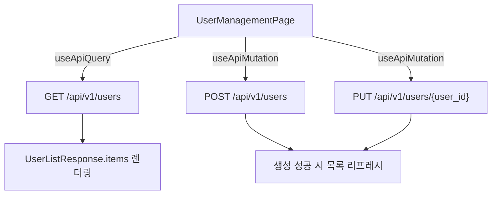

# Unit Spec: FR-18 사용자 관리 API 변경 대응 (Frontend)

## 1. 요구사항 요약

- **목적:** 사용자 관리 페이지(기구현)를 백엔드 최신 API 스펙(openapi.json)에 맞춰 연동하고, 입력/검증/권한 처리 흐름을 정합화한다.
- **유형:** ☑ 변경 ☐ 신규 ☐ 삭제
- **핵심 요구사항:**
  - 입력: 사용자 목록 필터/페이징/정렬, 사용자 생성/수정 폼 데이터, 부서 선택
  - 출력: `UserListResponse.items` 기반 목록/페이지네이션 렌더링, 생성/수정 결과 반영
  - 예외/제약: ADMIN 권한 필요, 비밀번호 정책(12자+대/소문자/특수문자), `department_ids` 누락 시 등록 불가, 업데이트 시 부서 필드 생략은 기존 매핑 유지
  - 처리흐름 요약: 사용자 관리 화면 → 목록 조회/필터링 → 생성/수정 요청 → 응답 반영/목록 갱신

---

## 2. 구현 대상 파일

| 구분 | 경로 | 설명 |
| ---- | ---- | ---- |
| 변경 | src/lib/api/users.ts | Mock → 실제 API 연동, 응답 래핑 구조 반영 |
| 변경 | src/types/users.ts | `UserListResponse`, `UserResponse`, 요청 타입 정합화 |
| 변경 | src/hooks/useUsers.ts | ApiResponse 기반 로딩/에러 처리, 페이징 반영 |
| 변경 | src/components/admin/UserSearchPanel.tsx | `department_code` 기반 필터, 정렬/페이지 입력 |
| 변경 | src/components/admin/UserTable.tsx | `UserResponse.departments` 표시 매핑 |
| 변경 | src/components/admin/UserRegistrationModal.tsx | 비밀번호 정책/부서 ID 기반 생성 |
| 변경 | src/pages/admin/UserManagementPage.tsx | 목록/등록/수정/삭제 플로우 재정렬 |
| 변경 | src/lib/api/index.ts | 사용자 API export 유지/보강 |
| 변경 | src/types/index.ts | 사용자 타입 export 유지/보강 |

---

## 3. 동작 플로우 (Mermaid)



---

## 4. 현행 구현 요약 (WORK_LOG 기준)

- 사용자 관리 화면은 `src/pages/admin/UserManagementPage.tsx`에 구현 완료.
- 검색 패널/테이블/등록 모달/삭제 확인 다이얼로그 구성.
- Manual ID 스크롤/하이라이트 기능 제공.
- API 레이어(`src/lib/api/users.ts`)는 Mock 구현이며, 실제 백엔드 연동 TODO 존재.
- 검색 조건은 `employee_id`, `name`, `role`, `is_active`, `department_name` 기반.
- 삭제 기능은 UI/로직이 있으나 openapi에는 사용자 삭제 엔드포인트가 명시되지 않음.

---

## 5. 테스트 계획

### 5.1 원칙

- **API 계약 정합성**: `ApiResponse<T>` 래핑 및 `isApiSuccess`/`isApiError` 가드 사용.
- **입력 검증**: 프론트 단 비밀번호 정책/필수값 검증 우선.
- **권한/오류 흐름**: ADMIN 미권한 또는 403/401 응답 시 피드백/에러 메시지 확인.

### 5.2 구현 예상 테스트 항목(각 항목의 목적 포함)

| TC ID | 계층 | 시나리오 | 목적(무엇을 검증?) | 입력/사전조건 | 기대결과 |
| ----- | ---- | -------- | ------------------ | -------------- | -------- |
| TC-UI-001 | UI | 목록 조회 기본 진입 | 기본 조회 파라미터/응답 매핑 | page=1, page_size=20 | 목록 렌더링, 페이징 정보 표시 |
| TC-UI-002 | UI | 필터/정렬 변경 | 쿼리 파라미터 매핑 | employee_id/name/role 등 | 쿼리 반영, 목록 갱신 |
| TC-FORM-003 | UI | 사용자 생성 유효성 | 비밀번호 정책 검증 | 12자 미만/특수문자 없음 | 제출 차단, 안내 메시지 |
| TC-API-004 | API | 생성 성공 | POST 응답 처리 | 정상 입력 | 성공 피드백, 목록 갱신 |
| TC-API-005 | API | 수정 시 부서 미전송 | 부서 매핑 유지 | department_ids 미포함 | 기존 부서 유지, 오류 없음 |
| TC-UI-006 | UI | Manual ID 스크롤 | 자동/수동 이동 동작 | /admin/users?manual_id=E002 | 해당 행 스크롤/하이라이트 |

### 5.3 샘플 테스트 코드

프론트 테스트 프레임워크 구성 후 `src/pages/admin/__tests__/UserManagementPage.test.tsx`에 테스트 케이스 작성.

---

## 6. API 스펙 정합화 체크리스트 (openapi.json 기반)

### 6.1 목록 조회 GET `/api/v1/users`
- 쿼리 파라미터: `employee_id`, `name`, `department_code`, `role`, `is_active`, `page`, `page_size`, `sort_by`, `sort_order`
- 응답: `UserListResponse` (`items`, `total`, `page`, `page_size`, `total_pages`)
- 프론트 변경 포인트:
  - `department_name` → `department_code` 매핑
  - `is_active` string → boolean 변환
  - 페이징/정렬 UI 및 state 추가

### 6.2 생성 POST `/api/v1/users`
- 요청: `UserAdminCreate`
  - 필수: `employee_id`, `name`, `password`, `department_ids`
  - 선택: `role`, `is_active`, `primary_department_id`
- 프론트 변경 포인트:
  - 비밀번호 정책(12자+, 대/소문자/특수문자) UI 검증 추가
  - 부서 선택 → `department_ids` (uuid) 전송

### 6.3 수정 PUT `/api/v1/users/{user_id}`
- 요청: `UserAdminUpdate`
  - 선택: `name`, `role`, `is_active`, `password`, `department_ids`, `primary_department_id`
  - `department_ids`/`primary_department_id` 생략 시 기존 부서 유지
- 프론트 변경 포인트:
  - 수정 모달/폼 추가
  - 부서 필드 생략 시 기존 유지 안내 및 payload 구성

### 6.4 검색 GET `/api/v1/users/search`
- 목적: 간단 검색 결과 배열(`UserResponse[]`)
- 활용 가능 지점: Manual ID 검색 보조, 검색 자동완성 등에 재검토

### 6.5 미정합 항목
- openapi에 사용자 삭제 API가 없음 → UI 삭제 기능 처리 방향 결정 필요
- `username` 필드 요구 여부는 openapi에 없음 → 백엔드와 최종 확인 필요

---

## 7. 사용자 요청 프롬프트

**Original User Request (1차):**

```
타스크번호 : FR-18
백엔드에서 다음와 같은 내용을 수정했다고 하는데 프론트 엔드도 현재 사용중인 프로젝트에 변경사항에 대한 대응 계획을  unit_spec 으로 작성해줘

[백엔드 작업내역] :
GET /api/v1/users, POST /api/v1/users, PUT /api/v1/users/{user_id} 변경
권한 ADMIN 필요, 비밀번호 정책(12자+, 대/소문자/특수문자), 부서 매핑 유지 규칙 포함
```

**User Clarification/Modification (2차+):**

```
WORK_LOG_USER_MANAGEMENT.md를 분석한 후 UnitSpec 갱신
openapi.json을 참조
```

**최종 명확화 (통합):**
- ✅ 기존 사용자 관리 기능 구현 내역을 반영해 unit_spec 갱신
- ✅ openapi.json 기준으로 API 정합화 항목 포함

---

**요청 일시:** YYYY-MM-DD

**컨텍스트/배경:**
- 사용자 관리 API 변경에 따른 프론트 수정 범위 정리
- 사용자 관리 페이지 기구현 상태 반영
